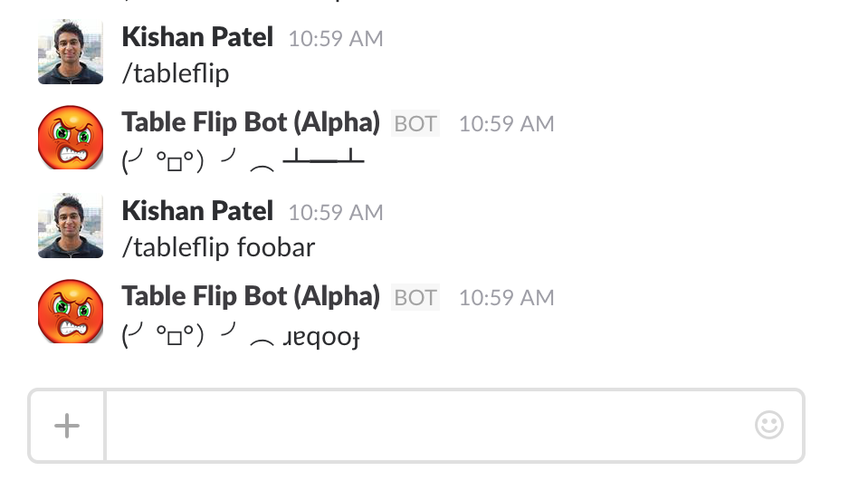

# Slack-Command-Manager-API

This API allows you to easily set up custom commands on Slack. 

Right now API includes the follow custom commands: 
* /tableflip



## Installation

### 1. virtualenv
Create [virtualenv](http://www.virtualenv.org/) for your own project:
  ```
 $ virtualenv projectname
```
 

### 2. Download

    $ cd /path/to/your/workspace
    $ git clone git@github.com:kishan/Slack-Command-Manager-API.git slack_app
    $ cd slack_app

### 3. Requirements
`$ pip install -r requirements.txt`

### 4. [Set up Command on Slack](https://my.slack.com/services/new/slash-commands)

### 5. Configure Verification Tokens for Commands

* Toggle VERIFY_COMMANDS variable in settings.py
* Store command tokens as environment variables

### 6. Runserver

   ```
  $ python manage.py runserver
  $ ngrok http 8000
```
set forwarding url from ngrok as URL for command (Ex. http://xxxxxxxx.ngrok.io/)
